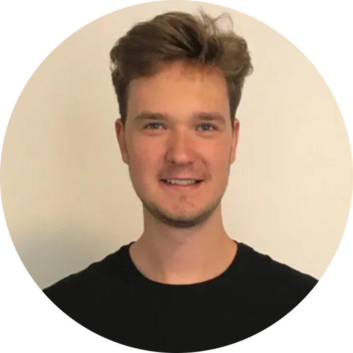
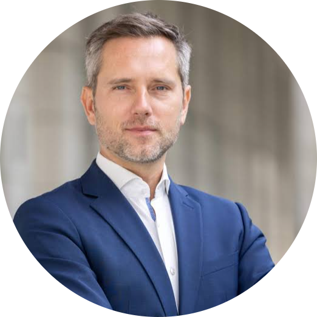
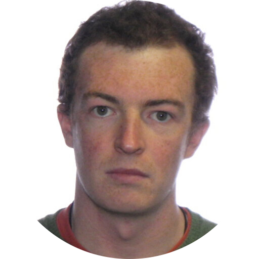
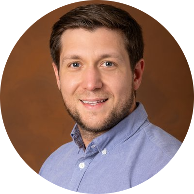

# Speakers

Confirmed speakers are listed below. Additional speakers and organizations will be added once their attendance is confirmed.

## Invited Speakers

|| Name                      | Affiliation                    | Talk Title |
||---------------------------|-------------------------------|------------|
|| Robin Murphy              | Texas A&M (USA)               | Disasters from the Inside |
| | Kaushik Jayaram                       | University of Colorado, Boulder (USA)      | Effective Omnidirectional Confined Space Locomotion with Shapeshifting Insect-Scale Robots  |
|| Alex Kübler               | RoBoa (Switzerland)           | Testing RoBoa for Search & Rescue Missions with the Swiss Rescue Troops |
|| Mirko Kovac               | EMPA + EPFL (Switzerland)         | Sustainability Robotics: Multi-modal Drones for Environmental Sensing in Air and Water  |
|| Ian Delaney               | U. Lausanne (Switzerland)     | Pressing Glaciological Questions that Soft Robots Could Help Answer  |
|| Hannah Stuart             | UC Berkeley (USA)             | Confirmed, TBD  |
|| Paul Glick                | NASA/JPL (USA)                | Infusion Pathways for New Technology in Space Exploration  |
|| Rebecca Kramer-Bottiglio  | Yale (USA)                    | Confirmed, TBD  |
|| Elena McCarthy            | ONR (UK)                      | Towards a New Generation of Soft Ocean Sensors |
