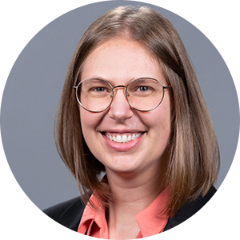
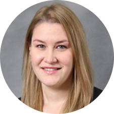

# Speakers

Confirmed speakers are listed below. Additional speakers and organizations will be added once their attendance is confirmed.

## Invited Speakers

|| Name                      | Affiliation                    | Talk Title |
||---------------------------|-------------------------------|------------|
|| Robin Murphy              | Texas A&M (USA)               | Confirmed, TBD |
| | TBD                       | Swiss Army (Switzerland)      | TBD  |
|| Alex Kübler               | RoBoa (Switzerland)           | Confirmed, TBD |
|| Mirko Kovac               | Imperial College (UK)         | Confirmed, TBD  |
|| Ian Delaney               | U. Lausanne (Switzerland)     | Pressing Glaciological Questions that Soft Robots Could Help Answer  |
|| Hannah Stuart             | UC Berkeley (USA)             | TBD  |
|| Paul Glick                | NASA/JPL (USA)                | TBD  |
|| Rebecca Kramer-Bottiglio  | Yale (USA)                    | Confirmed, TBD  |
|| Elena McCarthy            | ONR (UK)                      | Towards a New Generation of Soft Ocean Sensors |
